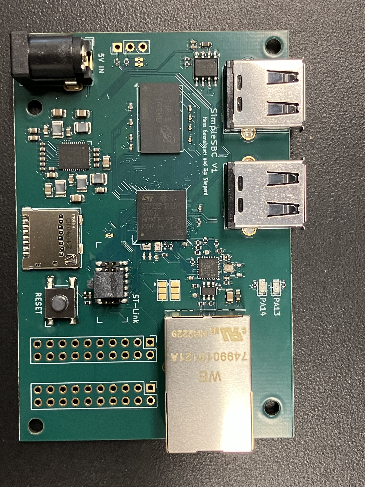

# SimpleSBC
A simple, open source SBC built around the STM32MP1



## Getting Started
1. `git clone` this repository
2. Run `git submodule init` and `git submodule update --recursive` to get Yocto and layers
3. Install dependencies:
   ```
   sudo apt update
   sudo apt upgrade
   sudo apt install -y bc build-essential chrpath cpio diffstat gawk git texinfo wget gdisk python3 python3-pip
   ```
4. Run `source poky/oe-init-build-env build-simplesbc` to set up the environment
5. Run `bitbake custom-image` to build! This could take a while
6. After the build, use yocto\copy_sd.sh to set up an SD card. You may need to change the device name in the script.
7. Connect an ST-Link or other USB-Serial converter, and plug in power.
8. Enjoy linux! The default meta-custom layer includes python and some python libraries. 

## Related Projects
- [Linux-Keyer](https://github.com/hansgaensbauer/Linux-Keyer/tree/main): A real-time linux based CW keyer built around SimpleSBC
